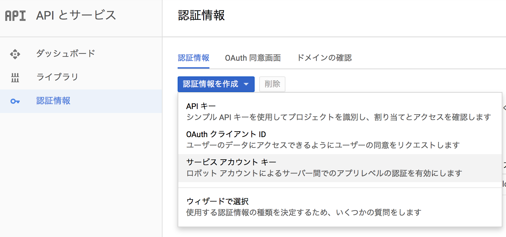
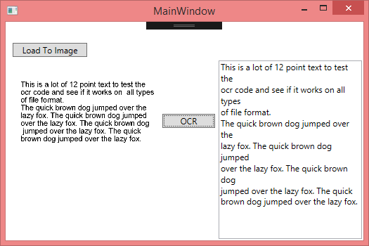

# SimpleOCRApp_for_GoogleCloudVisionAPI
OCR text detection with google APIs C#, implement text detection using google API with C#,

Read more on my blog :

After searching more than 3 hrs to know how to implement text detection using google API i decided to write this post, hope it help c# developer to know how to use and implement Vision API,

Source Code :

1- Create server key on google console



* Go to http://console.developers.google.com/ and create new project or use existing project
* From Overview page enable vision API


* You need to create new bill information to use vision API, it's fully free for 1st 1000 request/ month you can check https://cloud.google.com/vision/docs/pricing
* After Enable Google Cloud Vision API go to Credentials page and create new server key

* Create key by fill all requested data and download Json file


2- Create Visual studio project I'll use vs 2015 and .NET framework 4.5
* Add google Nuget packages : Google.Apis.Vision.v1 by right click on project and then manage nuget package .


* Register the JSON file in the environment variable.
* Environment variable name is "GOOGLE_APPLICATION_CREDENTIALS"

```
private VisionService CreateAuthorizedClient()
{
    GoogleCredential credential =
        GoogleCredential.GetApplicationDefaultAsync().Result;
    // Inject the Cloud Vision scopes
    if (credential.IsCreateScopedRequired)
    {
        credential = credential.CreateScoped(new[]
        {
            VisionService.Scope.CloudPlatform
        });
    }
    return new VisionService(new BaseClientService.Initializer
    {
        HttpClientInitializer = credential,
        GZipEnabled = false
    });
}
```
* Set it to the environment variable and make a request to the Cloud Vision API using the service account key.
* Create batch request to upload image and get result :
```
private int DetectTextWord(
    VisionService vision, byte[] getImage, ref string FullText)
{
    int result = 1;
    Console.WriteLine("Detecting image to texts...");
    // Convert image to Base64 encoded for JSON ASCII text based request   
    string imageContent = Convert.ToBase64String(getImage);

    try
    {
        // Post label detection request to the Vision API
        var responses = vision.Images.Annotate(
            new BatchAnnotateImagesRequest()
            {
                Requests = new[] {
            new AnnotateImageRequest() {
                Features = new [] { new Feature() { Type =
                  "TEXT_DETECTION"}},
                Image = new Image() { Content = imageContent }
            }
           }
            }).Execute();

        if (responses.Responses != null)
        {
            FullText = responses.Responses[0].TextAnnotations[0].Description;

            Console.WriteLine("SUCCESS：Cloud Vision API Access.");
            result = 0;
        }
        else
        {
            FullText = "";
            Console.WriteLine("ERROR : No text found.");
            result = -1;
        }
    }
    catch
    {
        FullText = "";
        Console.WriteLine("ERROR : Not Access Cloud Vision API.");
        result = -1;
    }

    return result;
}
```
* Vision api have a lot of type like face detection and other types I use text_detiction https://cloud.google.com/vision/reference/rest/v1/images/annotate#Type
* As a precaution, try-catch describes exception handling. However, it is not a smart description.
* Excute request to get result
```
public int getTextAndRoi(byte[] getImage, ref string FullText)
{
    int result = 1;
    GCPVisonAPI sample = new GCPVisonAPI();
    // Create a new Cloud Vision clieuthorint azed via Application
    // Default Credentials
    VisionService vision = sample.CreateAuthorizedClient();
    // Use the client to get label annotations for the given image
    string getFullText = "";
    result = sample.DetectTextWord(vision, getImage, ref getFullText);
    FullText = getFullText;
    return result;
}
```
* As a result of the API, you can get the full text of OCR, each word list, region list of each word ·
* This time we will receive the full text of the OCR result.



Google reference :
* https://cloud.google.com/vision/docs/
* https://cloud.google.com/vision/reference/rest/v1/images/annotate
* https://cloud.google.com/vision/docs/label-tutorial?hl=ja
